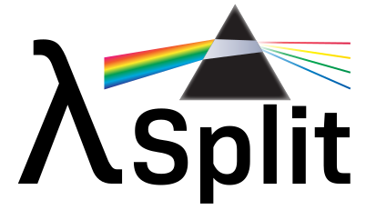
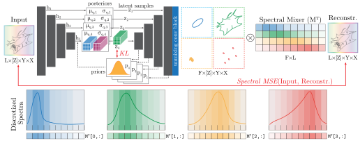

<!-- <div align="center"> uncomment once repo goes public
  
</div> -->
<div align="center">
  
</div>

---

# λSplit: Self-Supervised Content-Aware Spectral Unmixing for Fluorescence Microscopy

<p align="left">
  <a href="https://arxiv.org/abs/2603.23647"></a>
  <a href="artworks/lambdaSplit_poster_landscape_ECCV2026.pdf"></a>
  <a href="https://www.youtube.com/watch?v=04zUPo4hcE4"></a>
  <a href="https://eccv.ecva.net/virtual/2026/poster/4844">
</p>

**λSplit** is a self-supervised method for spectral unmixing in fluorescence microscopy. 
It combines a Ladder VAE with a physics-based Spectral Mixer that encodes the image-formation model, enabling it to separate overlapping fluorophore emissions without ground-truth supervision.
Compared to classical, pixel-wise unmixing methods, **λSplit** leverages spatial context, improving unmixing performance and robustness in
challenging imaging regimes, such as in presence of considerable noise, highly overlapping spectra, or reduced spectral dimensionality. 

A more detailed description of the method can be found in [the preprint](https://doi.org/10.48550/arXiv.2603.23647).

*Presented at ECCV 2026.*

<div align="center">
  
</div>

> [!WARNING]
> **Code availability.** The code for λSplit is not yet publicly available.
>
> λSplit is the subject of pending patent applications held by Fondazione Human Technopole.
> We are finalizing the licensing terms for the public release, which we intend to make
> under a strong copyleft license, alongside a separate commercial licensing track for
> uses falling outside those terms.
>
> We expect to release the code once these terms are in place. Until then, no license to
> the methods described in this repository or in the accompanying paper is granted,
> expressed or implied.
>
> We are not accepting contributions at this time. A contributor license agreement will
> be in place before the code is released.
>
> For licensing inquiries, contact federico.carrara@fht.org and florian.jug@fht.org.
> >
> To be notified when the code is released, click **Watch** above and select
> **Custom → Releases**.

<!-- ## Installation -->

<!-- ## How to Use -->

## Citation

If you find this work useful, please cite:

```bibtex
@inproceedings{carrara2026lambdasplit,
  title     = {λSplit: Self-Supervised Content-Aware Spectral Unmixing for Fluorescence Microscopy},
  author    = {Carrara, Federico and Lambert, Talley and Seifi, Mehdi and Jug, Florian},
  booktitle = {European Conference on Computer Vision (ECCV)},
  year      = {2026}
}
```
